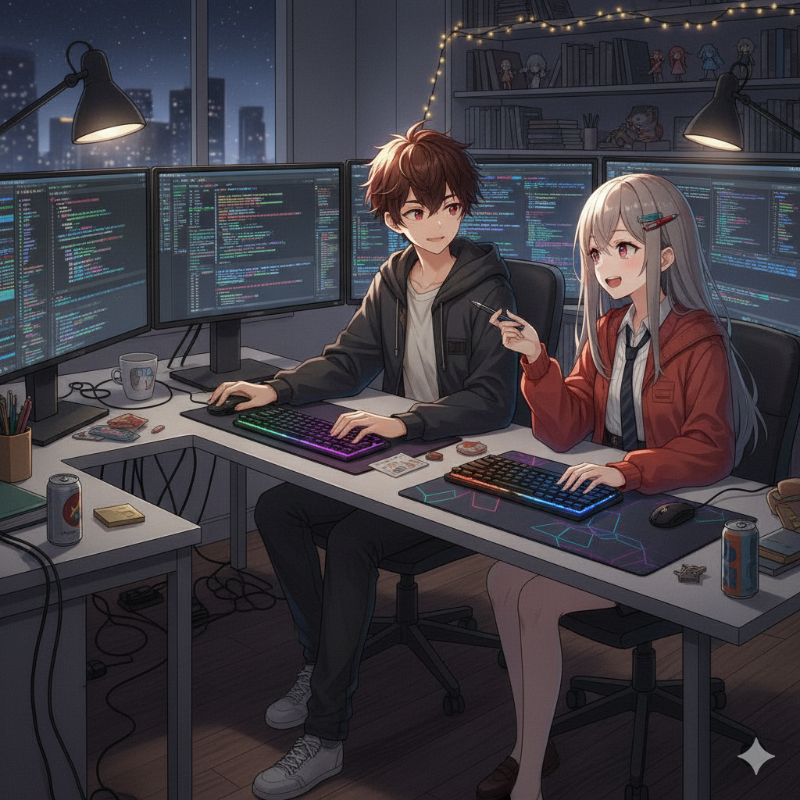
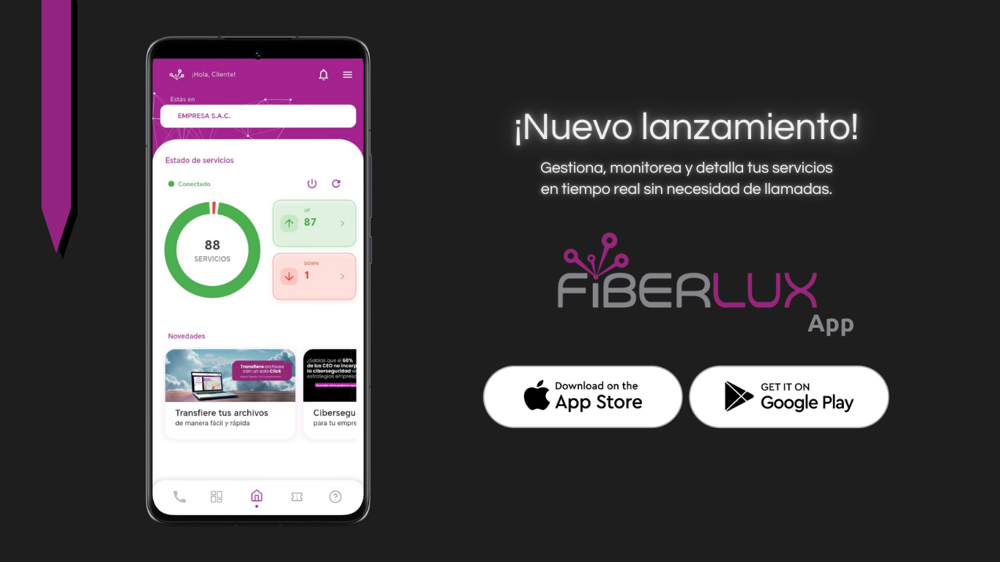

# ✍️📚 ╰•★★ Jeanpool Ferrer ★★•╯💠✨
<h1 align="center">✨🔥 Bienvenido a Mi Repositorio ✨🔥</h1>
<h4 align="center">Si puedes imaginarlo, entonces puedes crearlo. - Walt Disney</h4>

  
  
  

  

<table align="center">
  <tr>
    <td align="center" width="300">
      
    </td>
    <td align="left" valign="middle">
      <blockquote> 
        "De no haber sido por ti, estoy seguro que no me hubiera arriesgado a llegar hasta aquí.  
        Todo lo que soy, todo lo que he obtenido es gracias a ti y por eso estarás siempre de primera en las cosas que consiga y haga. 
          
        Seguiré cumpliendo esa promesa por la que estamos peleando tan arduamente y si la distancia duele entre los dos, crearemos un mundo en donde estemos tú y yo...
        <b>Solo tú y yo~</b> 🤍✨"  
      </blockquote>
    </td>
  </tr>
</table>

  <!-- Lenguajes -->
  
  
  
  
  
  
  

  <!-- Frameworks & SDKs -->
  
  
  
  
  
  

  <!-- Herramientas de desarrollo -->
  
  
  
  
  
  

  <!-- Bases de datos -->
  

  <!-- Diseño/UI -->
  
  

## 📌 Últimos logros
- 5/01/26  | Lanzamiento oficial de **Mi ZaaZ Perú** en Google Play
- 4/11/25  | Lanzamiento oficial de **Fiberlux App** en App Store
- 29/10/25 | Lanzamiento oficial de **Fiberlux App** en Google Play
- 08/09/25 | Luz verde para lanzar la nueva **Fiberlux App** a las tiendas móviles oficiales.
- 10/07/25 | Certificado del DMC Institute: **Desarrollador Móvil Android**.  
  👉 [Ver certificado](https://certificado.dmc.pe/17642/68a76f97eed13)

## 📄 Índice
- [Sobre mí](#sobre-mi)
- [Proyectos en producción](#proyectos)
- [Últimos logros](#ultimos-logos)
- [Tecnologías principales](#tecnologias)

## 🚀 Proyectos en producción
- **Mi Nubyx**  
  
  
   
  
  

- **Fiberlux App**    
  
  
     
  

- **Mi ZaaZ Perú**  
  
  

## 🙋‍♂️ Sobre mí

> Soy **Jeanpool Ferrer**, desarrollador mobile con experiencia en **Flutter, Dart, Firebase y Android/Kotlin**. Me apasiona crear soluciones **eficientes, escalables y fáciles de usar**. También me adapto a distintas tecnologías, pero mi foco es el desarrollo mobile multiplataforma. La idea de llevar una app en tu dispositivo, incluso sin conexión, me sigue fascinando al día de hoy.  

Actualmente estoy trabajando en:
- 📚 Profundizando en **arquitectura limpia en Flutter**.  
- 🌍 Primeros pasos de una app propia para Play Store.  
- 💻 Construyendo mi portafolio web.

## 🛠️ Tecnologías principales
- **Lenguajes:** Dart, Kotlin, Python, JavaScript, TypeScript  
- **Frameworks & SDKs:** Flutter, Firebase, Socket.io  
- **Herramientas:** Git, GitHub, VS Code, Android Studio  
- **Diseño/UI:** Figma, Canva

---

📬 **Contáctame en:**  

  
  
  

 

<table align="center">
  <tr>
    <td align="center" width="300">
      
    </td>
    <td align="left" valign="middle">
      <blockquote> 
       Sigamos esta travesía igual que como empezamos...~ Juntos 🤍✨💯 
      </blockquote>
    </td>
  </tr>
</table>
